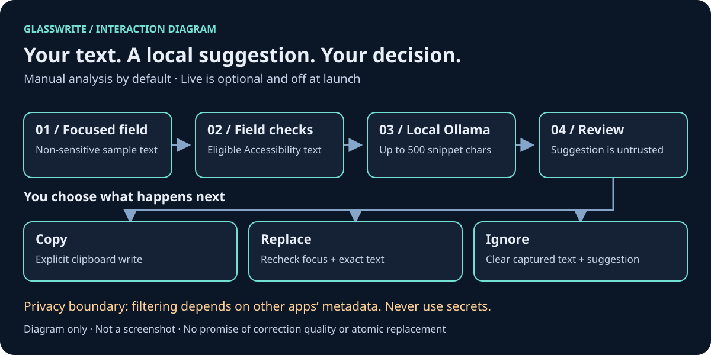

# GlassWrite

**A second look at your writing, with a local model and you in control.**

GlassWrite is a macOS menu-bar writing-assistant **prototype** by
Jesus Pacheco / Akitá Labs, prepared for Pachecodes. It reads an eligible
focused text field through Accessibility, asks Ollama for a correction,
and lets you review the suggestion before copying or requesting replacement.

For macOS tinkerers who want to try local writing assistance on ordinary,
non-sensitive text—not a production editor or a confidential-data tool.



*Interaction diagram, not an app screenshot or a model-quality demonstration.*

## What you can do

- Analyze a focused text field manually from the ✦ menu or floating overlay.
- Optionally turn on Live for analysis after a typing pause; **off at launch**.
- Review a correction, copy it, ignore it, or explicitly request replacement.
- Choose an installed Ollama model and test the local connection in Settings.

For example: type `This are a sample sentence.` in a normal text field,
choose **Analyze Now**, and review whatever your model returns. This is a
sample input, not a promised correction. Copy/paste is safer for rich text.

## Build and open

Requires **macOS 14+**, Xcode with its macOS SDK and command-line tools,
[XcodeGen](https://github.com/yonaskolb/XcodeGen), and separately installed
[Ollama](https://ollama.com). Run from the source checkout:

```sh
brew install xcodegen
xcodegen generate
xcodebuild -project GlassWrite.xcodeproj -scheme GlassWrite \
  -configuration Release -destination 'platform=macOS' \
  -derivedDataPath "$HOME/Library/Developer/Xcode/DerivedData/GlassWriteRelease" \
  build CODE_SIGNING_ALLOWED=NO
```

Open `GlassWrite.xcodeproj` in Xcode, select **GlassWrite**, and Run.
This is an unsigned source build, not a notarized download. For a stable app
path, signing and permission notes, see the [setup guide](docs/setup.md).

## Try it with Ollama

```sh
ollama serve             # only if Ollama is not already running
ollama pull qwen3.5:0.8b # default; availability is not guaranteed
ollama list
```

1. In **✦ → Settings**, use `http://127.0.0.1:11434`, Test / Refresh,
   and select an installed model. Only literal `127.0.0.1` is accepted.
2. Choose **Request Accessibility Permission** and enable this app in
   **System Settings → Privacy & Security → Accessibility**; restart if needed.
3. Focus non-sensitive sample text in another app and choose **Analyze Now**.
4. Review first. **Copiar** copies, **Reemplazar** requests a guarded replacement,
   and **Ignorar** clears the suggestion. Some UI labels are Spanish.

## Read before granting access

**Accessibility is broad system access. Use only a build you trust.**
Never use GlassWrite for secrets, financial, clinical or confidential text.
Sensitive-field filtering depends on other apps' metadata; it is not universal.
No Screen Recording, camera or microphone permission is used.

There is no automatic clipboard reading, analytics or document history.
Up to 500 snippet characters go to local Ollama; local services, OS diagnostics,
swap and clipboard history remain outside the app's control. Local is not a
promise of secrecy: see the [full privacy boundaries](docs/privacy-and-limitations.md).

**Prototype caveats:** trailing text, not cursor-aware context; no undo,
app allowlist or comprehensive editor compatibility. Replacement may lose
formatting and cannot be atomic. Models can change meaning or return bad JSON.
Real app Accessibility behavior and end-to-end Ollama quality/latency were not
verified by the source release gates. Always review suggestions.

## More detail

- [Documentation index](docs/README.md) — complete technical reference.
- [Setup and usage](docs/setup.md) — build, local service, permissions, Live.
- [Privacy and limitations](docs/privacy-and-limitations.md) — capture, guards, risks.
- [Development and tests](docs/development.md) · [Contributing](CONTRIBUTING.md).
- [Security](SECURITY.md) · [Provenance](PROVENANCE.md).

## License

Original code is [MIT](LICENSE). Apple's frameworks, Ollama and model weights
have their own licenses; no third-party code or model weights are vendored.
